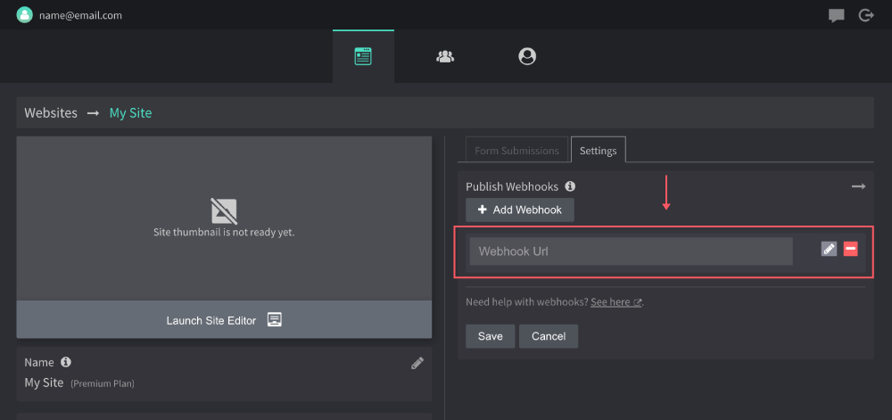

# Site Publish Webhook

This is a lambda function template you can use to run on site publishing events in Drzzle. What this does is loop through all  site files, downloads each one to lambda's `tmp/` folder for uploading elsewhere. You control where your files go!

### Prerequisite
All of this can be automated better in the future but for now, make sure you have created an empty lambda function in your AWS account using the latest node version. To make this easiest, title it `site-publish-hook`. If using a different name, be sure to update it in the deploy.sh file and in API Gateway.

### API Gateway
To invoke this function, you will need to set up a **REST API** using `API Gateway`. Follow the steps below to do so:

1. In your AWS dashboard, find API Gateway and click "Create API".
2. Find "REST API" and hit build.
3. Leave the defaults (New API) selected, give it a name then hit "Create API".
4. Click "Actions" -> "Create Method" and select "Post" from the dropdown.
5. In the method settings, make sure the following are selected:
  - Integration Type: Lambda Function
  - Use Lambda Proxy Integration: ✅
  - Lambda Region: (same region as lambda function)
  - Lambda Function: `site-publish-hook` _(or whatever you named the function)_
  - Use Default Timeout: ✅
6. Click "Actions" -> "Deploy API". For Deployment stage select [New Stage]. Then give it a name and hit "Deploy".

After the API is deployed, head over to Drzzle and add a new webhook in your site's admin panel, paste in the Invoke URL and hit save.



### Deployment
We included a simple bash script (`deploy.sh`) to zip this function up and auto upload it to your AWS account. You will need to have the AWS CLI installed first to use it. [See instructions](https://docs.aws.amazon.com/cli/latest/userguide/install-cliv2.html) for installing the CLI.

```bash
npm run deploy
```

### Lambda Disclaimer
Lambda has some limits on it's `tmp/` folder size. If you have media files over `512mb` the function may error. Do also keep in mind to set your lambda timeout long enough to handle the size of your website. It usually runs really quick.

If you have lots of large media files and fear that this function will timeout or error, then lambda may not be the way to go. You'd likely be better off setting up a small cloud server to handle this work. The good news is, you can still use the code in this function!
